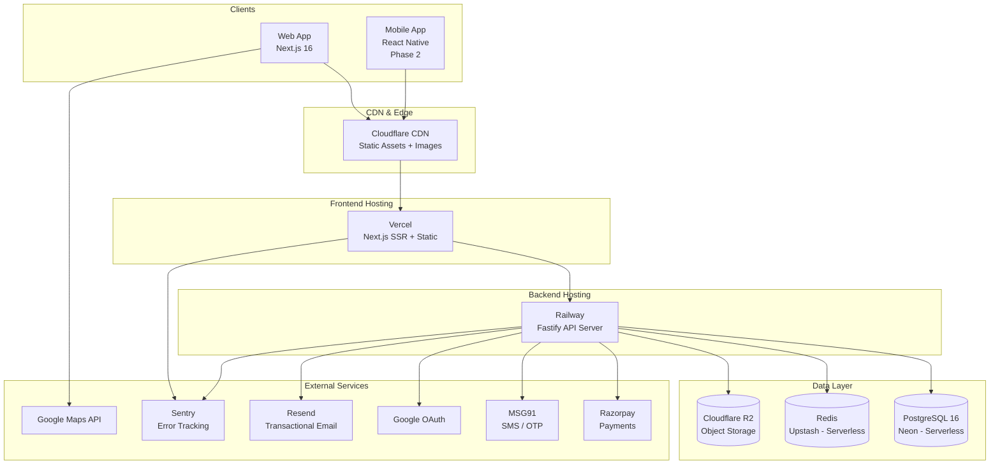
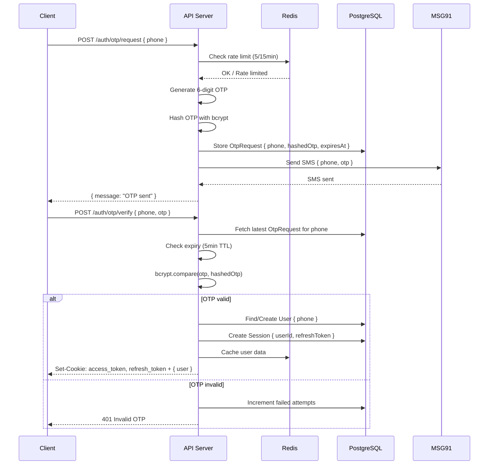
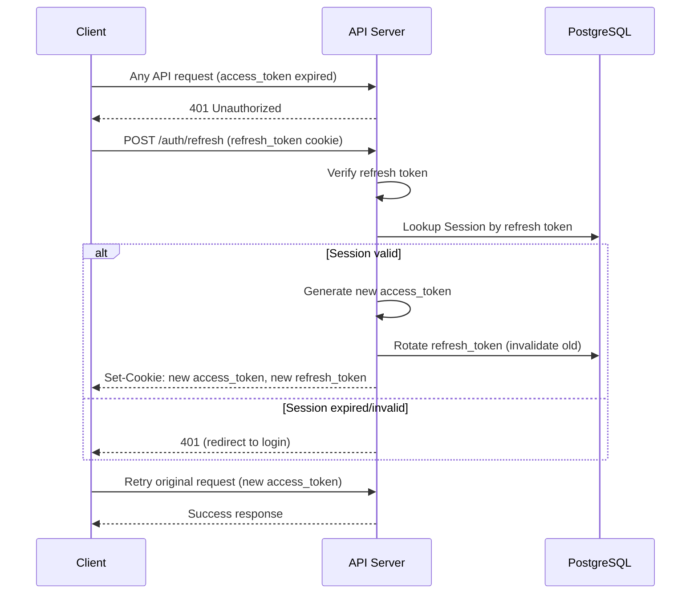
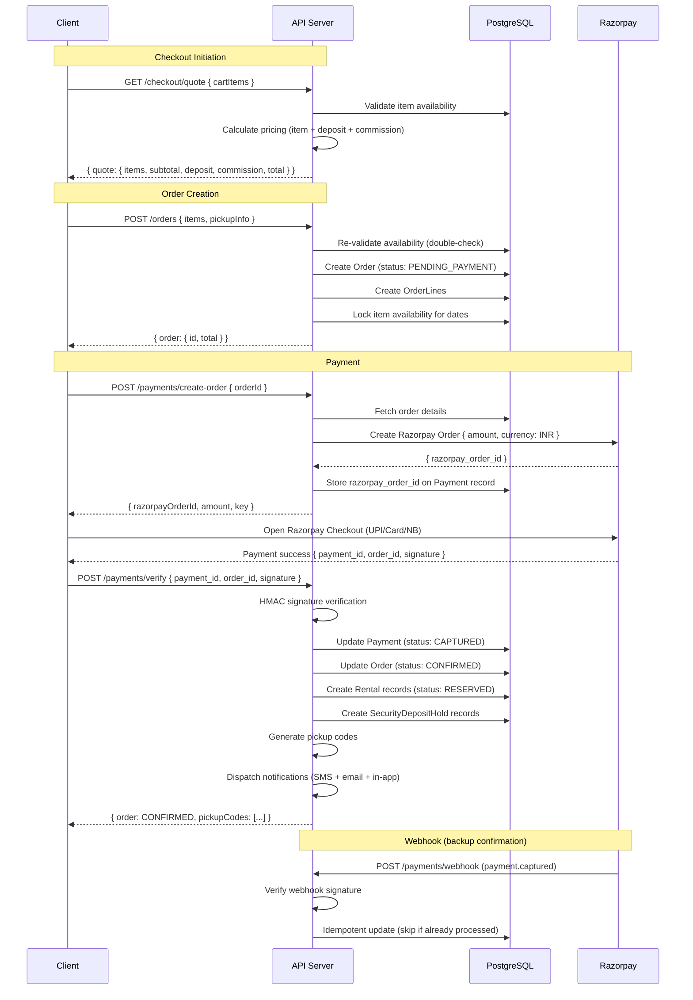
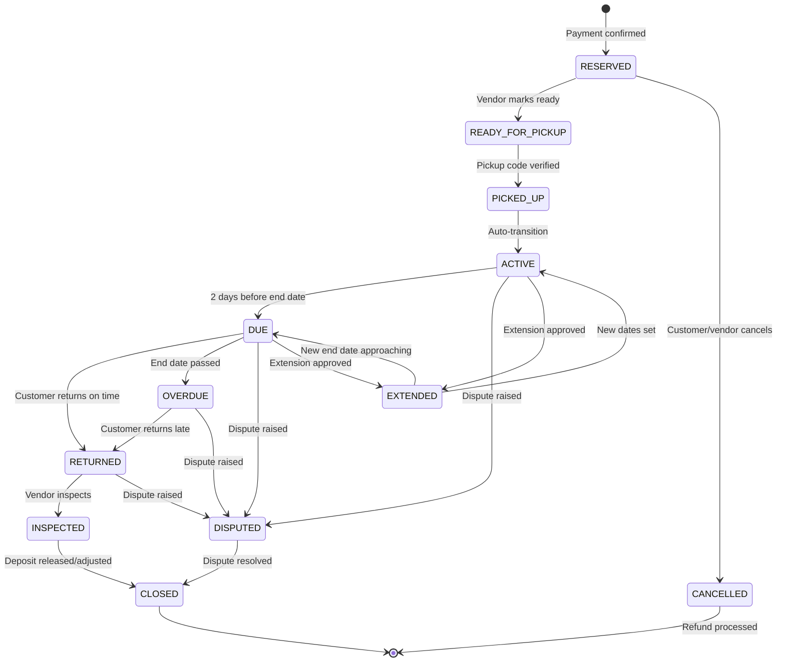
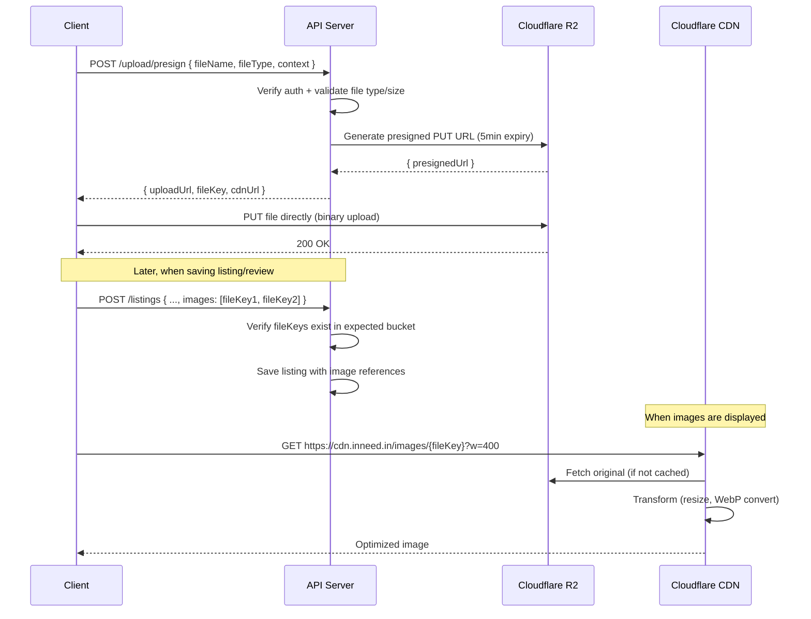
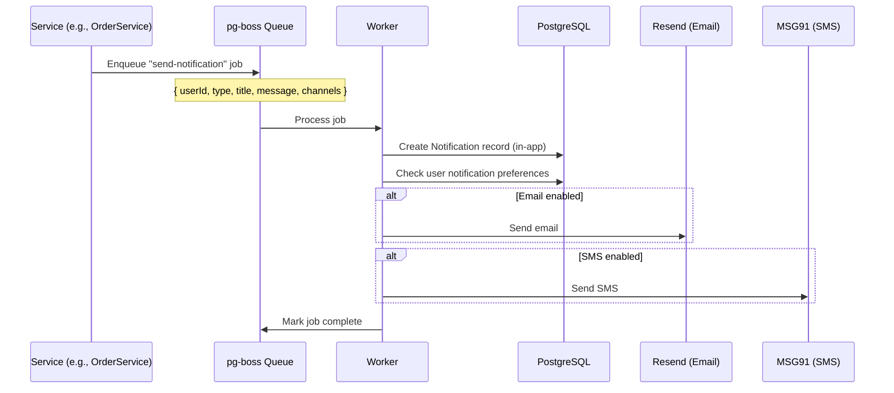

# INNEED — System & Component Architecture

> **Version**: 1.0
> **Last Updated**: March 2026
> **Status**: Draft

---

## 1. High-Level System Architecture



### Component Responsibilities

| Component | Responsibility |
|-----------|---------------|
| **Next.js (Vercel)** | Server-side rendering, static pages, API route proxying, frontend hosting |
| **Fastify (Railway)** | REST API, business logic, auth, payment processing, background jobs |
| **PostgreSQL (Neon)** | Primary data store, full-text search, job queue (pg-boss) |
| **Redis (Upstash)** | Session cache, rate limiting counters, OTP temp storage, API response cache |
| **Cloudflare R2** | Image storage, vendor documents, review photos, CDN delivery |
| **Razorpay** | Payment collection, security deposit holds, vendor payouts, refunds |
| **MSG91** | SMS OTP delivery, transactional SMS, rental reminders |
| **Google Maps** | Map rendering, geocoding, address autocomplete |
| **Resend** | Transactional emails (order confirmation, receipts, dispute updates) |
| **Sentry** | Error tracking, performance monitoring |

---

## 2. Frontend Architecture

### 2.1 Next.js 16 App Router Structure

```
frontend/src/
├── app/                           # Next.js App Router
│   ├── (public)/                  # Public routes (no auth required)
│   │   ├── page.tsx               # Homepage → /
│   │   ├── marketplace/           # Marketplace discovery
│   │   ├── category/[slug]/       # Category pages
│   │   ├── item/[id]/             # Item detail
│   │   ├── vendor/[id]/           # Vendor public profile
│   │   ├── search/                # Search results
│   │   ├── about/                 # About page
│   │   ├── how-it-works/          # How it works
│   │   ├── faq/                   # FAQ
│   │   ├── contact/               # Contact
│   │   ├── trust-safety/          # Trust & safety
│   │   └── policies/[type]/       # Privacy, terms, etc.
│   │
│   ├── (auth)/                    # Auth routes (redirect if logged in)
│   │   ├── login/                 # Login page
│   │   ├── signup/                # Registration
│   │   └── forgot-password/       # Password reset
│   │
│   ├── (customer)/                # Customer routes (auth required)
│   │   └── customer/
│   │       ├── dashboard/         # Customer dashboard
│   │       ├── orders/            # Order list + [id] detail + [id]/receipt
│   │       ├── rentals/[id]/      # Active rental detail
│   │       ├── saved/             # Wishlist
│   │       ├── wallet/            # Payment history
│   │       ├── notifications/     # Notification center
│   │       ├── disputes/          # Dispute list + [id] detail
│   │       └── settings/          # Profile & preferences
│   │
│   ├── (vendor)/                  # Vendor routes (auth + vendor required)
│   │   └── vendor/
│   │       ├── dashboard/         # Vendor dashboard
│   │       ├── onboarding/        # Vendor setup wizard
│   │       ├── listings/          # Listing management + /new + /[id]/edit
│   │       ├── booking-requests/  # Incoming bookings
│   │       ├── active-rentals/    # Current rentals
│   │       ├── orders/            # Vendor orders
│   │       ├── earnings/          # Revenue dashboard
│   │       ├── calendar/          # Availability calendar
│   │       ├── payout-settings/   # Bank account config
│   │       ├── disputes/          # Vendor disputes
│   │       └── return-inspection/[id]/ # Return inspection
│   │
│   ├── (admin)/                   # Admin routes (auth + admin required)
│   │   └── admin/
│   │       ├── dashboard/         # Admin overview
│   │       ├── users/             # User management
│   │       ├── vendor-approvals/  # Vendor verification queue
│   │       ├── listings/          # Listing moderation
│   │       ├── categories/        # Category management
│   │       ├── featured/          # Featured listings
│   │       ├── disputes/          # Dispute console
│   │       ├── transactions/      # Payment logs
│   │       └── settings/          # Commission config
│   │
│   ├── layout.tsx                 # Root layout
│   ├── error.tsx                  # Error boundary
│   ├── not-found.tsx              # 404 page
│   └── providers.tsx              # Provider wrapper
│
├── components/
│   ├── ui/                        # Shadcn/ui primitives (Button, Dialog, etc.)
│   ├── layout/                    # Header, Footer, DashboardLayouts
│   ├── common/                    # ProductCard, VendorCard, Breadcrumbs, etc.
│   └── auth/                      # RoleGuard, AuthForm components
│
├── views/                         # Page-level view components
│   ├── HomePage.tsx
│   ├── ItemDetailPage.tsx
│   ├── customer/                  # Customer view components
│   ├── vendor/                    # Vendor view components
│   ├── admin/                     # Admin view components
│   └── public/                    # Public page views
│
├── lib/
│   ├── api.ts                     # Axios API client (single instance)
│   └── utils.ts                   # Utility functions (cn, formatPrice, etc.)
│
├── hooks/
│   ├── useAuth.ts                 # Auth state hook
│   ├── useCart.ts                 # Cart operations hook
│   └── queries/                   # TanStack Query hooks
│       ├── useListings.ts
│       ├── useOrders.ts
│       ├── useRentals.ts
│       └── ...
│
├── contexts/
│   └── AppContext.tsx              # Global app state (auth, cart, preferences)
│
├── types/
│   └── index.ts                   # Shared TypeScript interfaces
│
└── styles/
    ├── globals.css                # Tailwind imports + CSS variables
    └── theme.css                  # Design tokens
```

### 2.2 Rendering Strategy

| Route Type | Rendering | Reason |
|-----------|-----------|--------|
| Homepage | SSR + ISR (revalidate: 60s) | SEO + fresh content |
| Category pages | SSR + ISR (revalidate: 60s) | SEO + fresh listings |
| Item detail | SSR | SEO + real-time availability |
| Search results | Client-side | Dynamic filters, no SEO benefit |
| Vendor profile | SSR + ISR | SEO |
| Customer dashboard | Client-side | Private, no SEO |
| Vendor dashboard | Client-side | Private, no SEO |
| Admin panel | Client-side | Private, no SEO |
| About, FAQ, Policies | Static (SSG) | Rarely changes |

### 2.3 State Management

```
┌─────────────────────────────────────────────────┐
│                  State Layers                    │
├─────────────────────────────────────────────────┤
│                                                  │
│  Server State (TanStack Query)                   │
│  ├── Listings, search results                    │
│  ├── Orders, rentals                             │
│  ├── Notifications                               │
│  ├── Reviews                                     │
│  ├── Cart (synced with server)                   │
│  └── Auto-caching, background refetch, stale-    │
│      while-revalidate                            │
│                                                  │
│  Client State (React Context - AppContext)        │
│  ├── User auth state                             │
│  ├── Global mode (rent/buy/both filter)          │
│  ├── Location preference                         │
│  └── UI preferences (theme)                      │
│                                                  │
│  Form State (React Hook Form + Zod)              │
│  ├── Login/signup forms                          │
│  ├── Listing creation form                       │
│  ├── Checkout form                               │
│  └── All forms with Zod validation               │
│                                                  │
│  URL State (Next.js searchParams)                │
│  ├── Search query                                │
│  ├── Filter values                               │
│  ├── Sort order                                  │
│  └── Pagination cursor                           │
│                                                  │
└─────────────────────────────────────────────────┘
```

### 2.4 API Client

Single Axios instance with interceptors:

```typescript
// lib/api.ts
const api = axios.create({
  baseURL: process.env.NEXT_PUBLIC_API_URL,
  withCredentials: true,  // Send cookies automatically
  timeout: 10000,
});

// Response interceptor: handle 401 (token refresh)
api.interceptors.response.use(
  (response) => response,
  async (error) => {
    if (error.response?.status === 401 && !error.config._retry) {
      error.config._retry = true;
      await api.post('/auth/refresh');  // Refresh token
      return api(error.config);         // Retry original request
    }
    return Promise.reject(error);
  }
);
```

### 2.5 Component Architecture

```
┌───────────────────────────────────────────┐
│  UI Primitives (Radix UI + Shadcn/ui)     │
│  Button, Dialog, Input, Select, Card,     │
│  Table, Badge, Tabs, Drawer, Sheet...     │
└────────────────────┬──────────────────────┘
                     │
┌────────────────────▼──────────────────────┐
│  Common Components                         │
│  ProductCard, VendorCard, SearchBar,      │
│  FilterPanel, MapView, RatingStars,       │
│  PriceDisplay, EmptyState, Breadcrumbs... │
└────────────────────┬──────────────────────┘
                     │
┌────────────────────▼──────────────────────┐
│  Layout Components                         │
│  Header, Footer, CustomerDashboard,       │
│  VendorDashboard, AdminDashboard          │
└────────────────────┬──────────────────────┘
                     │
┌────────────────────▼──────────────────────┐
│  View Components (Page Logic)              │
│  HomePage, ItemDetailPage, CartPage,      │
│  CheckoutPage, OrdersPage, etc.           │
└────────────────────┬──────────────────────┘
                     │
┌────────────────────▼──────────────────────┐
│  App Router Pages                          │
│  Thin wrappers: import View, pass params  │
└───────────────────────────────────────────┘
```

---

## 3. Backend Architecture

### 3.1 Fastify Application Structure

```
backend/src/
├── app.ts                         # Fastify app setup, plugin registration
├── server.ts                      # Entry point, start server
│
├── config/
│   ├── env.ts                     # Environment variable validation (Zod)
│   ├── db.ts                      # Prisma client initialization
│   ├── redis.ts                   # Redis client setup
│   └── razorpay.ts                # Razorpay SDK initialization
│
├── middleware/
│   ├── auth.ts                    # JWT verification, requireAuth
│   ├── vendor.ts                  # requireVendor (isVendorApproved check)
│   ├── admin.ts                   # requireAdmin (role check)
│   ├── rate-limit.ts              # Per-route rate limiting (Redis-backed)
│   ├── request-id.ts              # Unique request ID generation
│   └── error-handler.ts           # Global error handler
│
├── modules/
│   ├── auth/
│   │   ├── auth.controller.ts     # Route handlers
│   │   ├── auth.service.ts        # Business logic
│   │   ├── auth.routes.ts         # Route definitions + Zod schemas
│   │   └── auth.schemas.ts        # Request/response Zod schemas
│   │
│   ├── catalog/                   # Categories + Listings
│   │   ├── catalog.controller.ts
│   │   ├── catalog.service.ts
│   │   ├── catalog.routes.ts
│   │   └── catalog.schemas.ts
│   │
│   ├── cart/
│   │   ├── cart.controller.ts
│   │   ├── cart.service.ts
│   │   ├── cart.routes.ts
│   │   └── cart.schemas.ts
│   │
│   ├── checkout/
│   │   ├── checkout.controller.ts
│   │   ├── checkout.service.ts
│   │   ├── checkout.routes.ts
│   │   └── checkout.schemas.ts
│   │
│   ├── orders/
│   │   ├── order.controller.ts
│   │   ├── order.service.ts
│   │   ├── order.routes.ts
│   │   └── order.schemas.ts
│   │
│   ├── rentals/
│   │   ├── rental.controller.ts
│   │   ├── rental.service.ts
│   │   ├── rental.routes.ts
│   │   └── rental.schemas.ts
│   │
│   ├── payments/
│   │   ├── payment.controller.ts
│   │   ├── payment.service.ts     # Razorpay integration
│   │   ├── payment.routes.ts
│   │   └── payment.schemas.ts
│   │
│   ├── vendor/
│   │   ├── vendor.controller.ts
│   │   ├── vendor.service.ts
│   │   ├── vendor.routes.ts
│   │   └── vendor.schemas.ts
│   │
│   ├── admin/
│   │   ├── admin.controller.ts
│   │   ├── admin.service.ts
│   │   ├── admin.routes.ts
│   │   └── admin.schemas.ts
│   │
│   ├── reviews/
│   │   ├── review.controller.ts
│   │   ├── review.service.ts
│   │   ├── review.routes.ts
│   │   └── review.schemas.ts
│   │
│   ├── disputes/
│   │   ├── dispute.controller.ts
│   │   ├── dispute.service.ts
│   │   ├── dispute.routes.ts
│   │   └── dispute.schemas.ts
│   │
│   ├── notifications/
│   │   ├── notification.controller.ts
│   │   ├── notification.service.ts
│   │   ├── notification.routes.ts
│   │   └── notification.schemas.ts
│   │
│   └── upload/
│       ├── upload.controller.ts
│       ├── upload.service.ts      # Presigned URL generation
│       ├── upload.routes.ts
│       └── upload.schemas.ts
│
├── services/                      # Shared services
│   ├── email.service.ts           # Resend integration
│   ├── sms.service.ts             # MSG91 integration
│   ├── storage.service.ts         # Cloudflare R2 presigned URLs
│   └── notification.dispatch.ts   # Multi-channel notification dispatcher
│
├── jobs/                          # Background jobs (pg-boss)
│   ├── index.ts                   # Job registration
│   ├── overdue-rentals.ts         # Check and flag overdue rentals
│   ├── due-reminders.ts           # Send rental due reminders
│   ├── deposit-release.ts         # Auto-release deposits
│   ├── rating-aggregation.ts      # Recalculate average ratings
│   ├── otp-cleanup.ts             # Delete expired OTPs
│   ├── payout-processing.ts       # Process vendor payouts
│   └── cart-cleanup.ts            # Clear stale carts
│
├── utils/
│   ├── errors.ts                  # Custom error classes
│   ├── pagination.ts              # Cursor & offset pagination helpers
│   ├── haversine.ts               # Distance calculation
│   └── idempotency.ts             # Idempotency key handling
│
└── prisma/
    ├── schema.prisma              # Database schema
    ├── migrations/                # Migration history
    └── seed.ts                    # Seed data for development
```

### 3.2 Module Pattern

Each module follows a consistent pattern:

```
Controller (route handler)
    │
    ├── Validates request (via Zod schema in route definition)
    ├── Calls Service method
    ├── Returns response
    │
Service (business logic)
    │
    ├── Implements business rules
    ├── Calls Prisma for data access
    ├── Calls external services (Razorpay, MSG91, etc.)
    ├── Dispatches background jobs if needed
    └── Returns typed result
```

### 3.3 Request Lifecycle

```
Incoming Request
    │
    ├── 1. Fastify receives request
    ├── 2. Request ID middleware (generates unique ID, adds to headers)
    ├── 3. CORS check (Fastify CORS plugin)
    ├── 4. Rate limiting check (Redis-backed, per-route config)
    ├── 5. Body parsing (Fastify built-in)
    ├── 6. Route matching
    ├── 7. Auth middleware (if route is protected)
    │       ├── Extract JWT from httpOnly cookie
    │       ├── Verify JWT signature + expiry
    │       ├── Attach user to request
    │       └── Check role/vendor status if required
    ├── 8. Zod schema validation (request body, params, query)
    ├── 9. Controller handler
    ├── 10. Service business logic
    ├── 11. Database query (Prisma)
    ├── 12. Response serialization
    └── 13. Response sent

    On error at any step:
    └── Global error handler catches
        ├── Log error (Pino + Sentry)
        ├── Format user-friendly error response
        └── Return appropriate HTTP status
```

---

## 4. Authentication Flow

### 4.1 Phone OTP Authentication



### 4.2 Token Refresh



---

## 5. Order & Payment Flow



---

## 6. Rental Lifecycle State Machine



---

## 7. Deployment Architecture

### 7.1 Production Environment

```
┌──────────────────────────────────────────────────────┐
│                    Cloudflare                          │
│  ┌──────────┐    ┌──────────────┐    ┌──────────┐    │
│  │   CDN    │    │  R2 Storage  │    │  Images  │    │
│  │  (Edge)  │    │  (Objects)   │    │ Transform│    │
│  └────┬─────┘    └──────────────┘    └──────────┘    │
└───────┼──────────────────────────────────────────────┘
        │
┌───────▼──────────────────────────────────────────────┐
│                     Vercel                             │
│  ┌──────────────────────────────┐                     │
│  │   Next.js 16 Application     │                     │
│  │   - SSR (Serverless Functions)│                     │
│  │   - Static pages (Edge)      │                     │
│  │   - API route proxy          │                     │
│  └──────────────┬───────────────┘                     │
└─────────────────┼─────────────────────────────────────┘
                  │ HTTPS
┌─────────────────▼─────────────────────────────────────┐
│                    Railway                              │
│  ┌──────────────────────────────┐                      │
│  │   Fastify 5 API Server       │                      │
│  │   - REST API endpoints       │                      │
│  │   - Background jobs (pg-boss)│                      │
│  │   - WebSocket (Phase 2)      │                      │
│  └───────┬──────────┬───────────┘                      │
└──────────┼──────────┼──────────────────────────────────┘
           │          │
  ┌────────▼──┐  ┌───▼─────────┐
  │   Neon    │  │   Upstash   │
  │ PostgreSQL│  │    Redis    │
  │ (Serverless│  │ (Serverless)│
  │  Auto-    │  │             │
  │  suspend) │  │             │
  └───────────┘  └─────────────┘
```

### 7.2 Environment Configuration

| Variable | Development | Production |
|----------|------------|------------|
| `DATABASE_URL` | Local Docker PostgreSQL | Neon connection string |
| `REDIS_URL` | Local Docker Redis | Upstash connection string |
| `R2_ENDPOINT` | MinIO (local S3 mock) | Cloudflare R2 endpoint |
| `RAZORPAY_KEY_ID` | Test key | Live key |
| `RAZORPAY_KEY_SECRET` | Test secret | Live secret |
| `MSG91_AUTH_KEY` | Sandbox key | Production key |
| `GOOGLE_CLIENT_ID` | Dev OAuth app | Prod OAuth app |
| `GOOGLE_MAPS_API_KEY` | Dev key | Prod key (restricted) |
| `JWT_SECRET` | Dev secret | Strong random secret |
| `FRONTEND_URL` | http://localhost:3000 | https://inneed.in |
| `SENTRY_DSN` | — | Production DSN |

### 7.3 Local Development Setup

```yaml
# docker-compose.yml
services:
  postgres:
    image: postgres:16
    ports:
      - "5432:5432"
    environment:
      POSTGRES_DB: inneed
      POSTGRES_USER: inneed
      POSTGRES_PASSWORD: inneed_dev
    volumes:
      - pgdata:/var/lib/postgresql/data

  redis:
    image: redis:7-alpine
    ports:
      - "6379:6379"

  minio:
    image: minio/minio
    ports:
      - "9000:9000"
      - "9001:9001"
    environment:
      MINIO_ROOT_USER: minioadmin
      MINIO_ROOT_PASSWORD: minioadmin
    command: server /data --console-address ":9001"

volumes:
  pgdata:
```

### 7.4 CI/CD Pipeline

```
Push to main branch
    │
    ├── GitHub Actions Workflow
    │   ├── Install dependencies
    │   ├── Type check (tsc --noEmit)
    │   ├── Lint (ESLint)
    │   ├── Unit tests (Vitest)
    │   ├── Integration tests (Vitest + Supertest)
    │   ├── Build frontend (next build)
    │   ├── Build backend (tsc)
    │   └── E2E tests (Playwright) [on staging]
    │
    ├── On success:
    │   ├── Vercel auto-deploys frontend (git integration)
    │   ├── Railway auto-deploys backend (git integration)
    │   └── Prisma migrations applied (post-deploy hook)
    │
    └── On failure:
        └── Block deployment, notify team
```

---

## 8. Security Architecture

### 8.1 Authentication Layer

```
┌──────────────────────────────────────────────────┐
│                Client (Browser)                    │
│  ┌──────────────────────────────────────────┐     │
│  │  httpOnly cookies (auto-sent)             │     │
│  │  ├── access_token (JWT, 15min)           │     │
│  │  ├── refresh_token (opaque, 7 days)      │     │
│  │  └── csrf_token (double-submit)          │     │
│  └──────────────────────────────────────────┘     │
└───────────────────────┬──────────────────────────┘
                        │ HTTPS only
┌───────────────────────▼──────────────────────────┐
│                API Server                          │
│  ┌──────────────────────────────────────────┐     │
│  │  Auth Middleware                           │     │
│  │  1. Extract JWT from cookie              │     │
│  │  2. Verify signature (RS256 or HS256)    │     │
│  │  3. Check expiry                          │     │
│  │  4. Decode payload → userId, role        │     │
│  │  5. Attach user to request               │     │
│  │  6. Verify CSRF token for mutations      │     │
│  └──────────────────────────────────────────┘     │
│  ┌──────────────────────────────────────────┐     │
│  │  Role Middleware                           │     │
│  │  requireVendor → user.isVendorApproved   │     │
│  │  requireAdmin  → user.role === 'ADMIN'   │     │
│  └──────────────────────────────────────────┘     │
└──────────────────────────────────────────────────┘
```

### 8.2 Security Headers (Helmet)

```
Strict-Transport-Security: max-age=31536000; includeSubDomains
X-Content-Type-Options: nosniff
X-Frame-Options: DENY
X-XSS-Protection: 0
Referrer-Policy: strict-origin-when-cross-origin
Content-Security-Policy: default-src 'self'; script-src 'self' 'unsafe-inline' https://checkout.razorpay.com https://maps.googleapis.com; style-src 'self' 'unsafe-inline'; img-src 'self' data: https://*.r2.cloudflarestorage.com; connect-src 'self' https://api.razorpay.com https://maps.googleapis.com;
Permissions-Policy: camera=(), microphone=(), geolocation=(self)
```

### 8.3 Rate Limiting

| Endpoint Pattern | Limit | Window |
|-----------------|-------|--------|
| `POST /auth/otp/request` | 5 requests | 15 minutes |
| `POST /auth/otp/verify` | 10 requests | 15 minutes |
| `POST /auth/login` | 10 requests | 15 minutes |
| `GET /listings` (search) | 60 requests | 1 minute |
| `POST /orders` | 5 requests | 1 minute |
| `POST /payments/*` | 5 requests | 1 minute |
| General authenticated | 100 requests | 1 minute |
| General unauthenticated | 30 requests | 1 minute |

Rate limits tracked in Redis with sliding window algorithm.

### 8.4 Input Validation

Every route has a Zod schema:

```typescript
// Example: listing creation schema
const createListingSchema = z.object({
  body: z.object({
    title: z.string().min(3).max(100),
    description: z.string().min(10).max(2000),
    categoryId: z.string().uuid(),
    condition: z.enum(['NEW', 'LIKE_NEW', 'GOOD', 'FAIR', 'HEAVY_USE']),
    availableForRent: z.boolean(),
    availableForSale: z.boolean(),
    rentPriceDaily: z.number().positive().optional(),
    buyPrice: z.number().positive().optional(),
    securityDeposit: z.number().min(0),
    images: z.array(z.string().url()).min(1).max(10),
  }).refine(
    (data) => data.availableForRent || data.availableForSale,
    { message: "Must be available for rent or sale (or both)" }
  ),
});
```

---

## 9. Data Flow Diagrams

### 9.1 File Upload Flow



### 9.2 Notification Dispatch Flow



---

## 10. Scaling Considerations

### Current Design (MVP): Single Server

```
1 Fastify instance → 1 PostgreSQL → 1 Redis
Handles: ~1K concurrent users, ~10K registered users
```

### Phase 2: Horizontal Scaling

```
Load Balancer → N Fastify instances → 1 PostgreSQL (read replicas) → 1 Redis cluster
Handles: ~10K concurrent users, ~100K registered users
```

### Phase 3: Service Decomposition (if needed)

```
API Gateway → Microservices:
  - Auth service
  - Catalog service
  - Order service
  - Payment service
  - Notification service
  - Chat service (WebSocket)
Each with own database (bounded contexts)
```

**Key principle**: Start monolithic, split when pain points emerge. The modular backend structure makes future decomposition straightforward — each module is already a self-contained unit.
