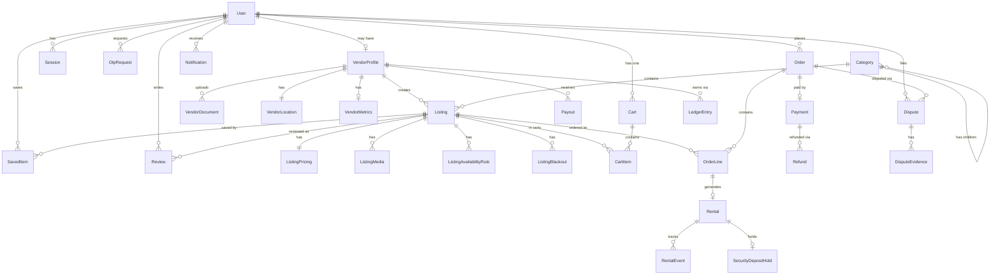

# INNEED — Database Entity Relationship Diagram (ERD)

> **Version**: 1.0
> **Last Updated**: March 2026
> **Status**: Draft
> **Database**: PostgreSQL 16

---

## 1. ERD Overview



---

## 2. Model Definitions

### 2.1 User (Authentication & Identity)

```
┌─────────────────────────────────────────────────────────────┐
│ User                                                         │
├─────────────────────────────────────────────────────────────┤
│ id              UUID         PK, default: gen_random_uuid()  │
│ email           String?      Unique, nullable                │
│ phone           String?      Unique, nullable                │
│ passwordHash    String?      bcrypt hash, nullable           │
│ name            String       Required                        │
│ avatar          String?      URL to profile image            │
│ role            UserRole     Enum: CUSTOMER, ADMIN           │
│ isVendorApproved Boolean     default: false                  │
│ googleId        String?      Unique, for OAuth               │
│ isActive        Boolean      default: true                   │
│ lastLoginAt     DateTime?                                    │
│ createdAt       DateTime     default: now()                  │
│ updatedAt       DateTime     @updatedAt                      │
├─────────────────────────────────────────────────────────────┤
│ Indexes:                                                     │
│   - UNIQUE(email) WHERE email IS NOT NULL                    │
│   - UNIQUE(phone) WHERE phone IS NOT NULL                    │
│   - UNIQUE(googleId) WHERE googleId IS NOT NULL              │
│ Constraints:                                                 │
│   - CHECK(email IS NOT NULL OR phone IS NOT NULL)            │
│     (must have at least one contact method)                  │
└─────────────────────────────────────────────────────────────┘
```

**Note**: `role` field only has CUSTOMER and ADMIN. Vendor capability is determined by `isVendorApproved` flag + VendorProfile existence. Every user is inherently a customer.

### 2.2 Session

```
┌─────────────────────────────────────────────────────────────┐
│ Session                                                      │
├─────────────────────────────────────────────────────────────┤
│ id              UUID         PK                              │
│ userId          UUID         FK → User.id                    │
│ refreshToken    String       Unique, hashed                  │
│ userAgent       String?      Browser/device info             │
│ ipAddress       String?                                      │
│ expiresAt       DateTime     7 days from creation            │
│ createdAt       DateTime     default: now()                  │
├─────────────────────────────────────────────────────────────┤
│ Indexes:                                                     │
│   - INDEX(userId)                                            │
│   - UNIQUE(refreshToken)                                     │
│   - INDEX(expiresAt) -- for cleanup job                      │
└─────────────────────────────────────────────────────────────┘
```

### 2.3 OtpRequest

```
┌─────────────────────────────────────────────────────────────┐
│ OtpRequest                                                   │
├─────────────────────────────────────────────────────────────┤
│ id              UUID         PK                              │
│ identifier      String       Phone or email                  │
│ hashedOtp       String       bcrypt hash (NEVER plaintext)   │
│ purpose         OtpPurpose   Enum: LOGIN, REGISTER, RESET   │
│ failedAttempts  Int          default: 0, max: 3              │
│ isUsed          Boolean      default: false                  │
│ expiresAt       DateTime     5 minutes from creation         │
│ createdAt       DateTime     default: now()                  │
├─────────────────────────────────────────────────────────────┤
│ Indexes:                                                     │
│   - INDEX(identifier, createdAt DESC)                        │
│   - INDEX(expiresAt) -- for cleanup job                      │
└─────────────────────────────────────────────────────────────┘
```

### 2.4 VendorProfile

```
┌─────────────────────────────────────────────────────────────┐
│ VendorProfile                                                │
├─────────────────────────────────────────────────────────────┤
│ id              UUID         PK                              │
│ userId          UUID         FK → User.id, UNIQUE (1:1)      │
│ businessName    String       Display name                    │
│ businessType    String       Individual / Business           │
│ phone           String       Business contact phone          │
│ bio             String?      About the vendor (max 500)      │
│ status          VendorStatus Enum: PENDING, APPROVED,        │
│                              REJECTED, SUSPENDED              │
│ rejectionReason String?      If rejected, why                │
│ approvedAt      DateTime?                                    │
│ approvedBy      UUID?        FK → User.id (admin)            │
│ createdAt       DateTime     default: now()                  │
│ updatedAt       DateTime     @updatedAt                      │
├─────────────────────────────────────────────────────────────┤
│ Indexes:                                                     │
│   - UNIQUE(userId)                                           │
│   - INDEX(status)                                            │
└─────────────────────────────────────────────────────────────┘
```

### 2.5 VendorLocation

```
┌─────────────────────────────────────────────────────────────┐
│ VendorLocation                                               │
├─────────────────────────────────────────────────────────────┤
│ id              UUID         PK                              │
│ vendorId        UUID         FK → VendorProfile.id, UNIQUE   │
│ street          String                                       │
│ city            String                                       │
│ state           String                                       │
│ pincode         String       Indian PIN code                 │
│ latitude        Float        For proximity calculations      │
│ longitude       Float        For proximity calculations      │
│ createdAt       DateTime     default: now()                  │
│ updatedAt       DateTime     @updatedAt                      │
├─────────────────────────────────────────────────────────────┤
│ Indexes:                                                     │
│   - UNIQUE(vendorId)                                         │
│   - INDEX(city)                                              │
│   - INDEX(latitude, longitude)                               │
└─────────────────────────────────────────────────────────────┘
```

### 2.6 VendorDocument

```
┌─────────────────────────────────────────────────────────────┐
│ VendorDocument                                               │
├─────────────────────────────────────────────────────────────┤
│ id              UUID         PK                              │
│ vendorId        UUID         FK → VendorProfile.id           │
│ type            DocType      Enum: AADHAAR, PAN, PASSPORT,   │
│                              DRIVING_LICENSE, OTHER           │
│ fileKey         String       R2 object key                   │
│ fileName        String       Original file name              │
│ status          DocStatus    Enum: PENDING, VERIFIED,        │
│                              REJECTED                         │
│ verifiedAt      DateTime?                                    │
│ createdAt       DateTime     default: now()                  │
├─────────────────────────────────────────────────────────────┤
│ Indexes:                                                     │
│   - INDEX(vendorId)                                          │
└─────────────────────────────────────────────────────────────┘
```

### 2.7 VendorMetrics

```
┌─────────────────────────────────────────────────────────────┐
│ VendorMetrics                                                │
├─────────────────────────────────────────────────────────────┤
│ id              UUID         PK                              │
│ vendorId        UUID         FK → VendorProfile.id, UNIQUE   │
│ averageRating   Float        default: 0                      │
│ totalReviews    Int          default: 0                      │
│ totalListings   Int          default: 0                      │
│ totalOrders     Int          default: 0                      │
│ totalEarnings   Decimal      default: 0 (INR)               │
│ responseTime    String?      e.g., "Within 1 hour"          │
│ updatedAt       DateTime     @updatedAt                      │
├─────────────────────────────────────────────────────────────┤
│ Indexes:                                                     │
│   - UNIQUE(vendorId)                                         │
└─────────────────────────────────────────────────────────────┘
```

### 2.8 Category

```
┌─────────────────────────────────────────────────────────────┐
│ Category                                                     │
├─────────────────────────────────────────────────────────────┤
│ id              UUID         PK                              │
│ name            String       Required                        │
│ slug            String       Unique, URL-friendly            │
│ description     String?                                      │
│ icon            String?      Lucide icon name                │
│ parentId        UUID?        FK → Category.id (self-ref)     │
│ sortOrder       Int          default: 0                      │
│ commissionRate  Float?       Override global commission       │
│ isActive        Boolean      default: true                   │
│ createdAt       DateTime     default: now()                  │
│ updatedAt       DateTime     @updatedAt                      │
├─────────────────────────────────────────────────────────────┤
│ Indexes:                                                     │
│   - UNIQUE(slug)                                             │
│   - INDEX(parentId)                                          │
│   - INDEX(sortOrder)                                         │
└─────────────────────────────────────────────────────────────┘
```

### 2.9 Listing

```
┌─────────────────────────────────────────────────────────────┐
│ Listing                                                      │
├─────────────────────────────────────────────────────────────┤
│ id              UUID         PK                              │
│ vendorId        UUID         FK → VendorProfile.id           │
│ categoryId      UUID         FK → Category.id                │
│ title           String       max 100                         │
│ description     String       max 2000                        │
│ condition       ItemCondition Enum: NEW, LIKE_NEW, GOOD,     │
│                              FAIR, HEAVY_USE                  │
│ availableForRent Boolean     Vendor decides                  │
│ availableForSale Boolean     Vendor decides                  │
│ quantity        Int          default: 1                      │
│ features        String[]     Array of feature strings        │
│ status          ListingStatus Enum: DRAFT, ACTIVE, PAUSED,   │
│                              ARCHIVED, FLAGGED                │
│ isFeatured      Boolean      default: false (admin-set)      │
│ latitude        Float?       Override vendor location         │
│ longitude       Float?       Override vendor location         │
│ createdAt       DateTime     default: now()                  │
│ updatedAt       DateTime     @updatedAt                      │
├─────────────────────────────────────────────────────────────┤
│ Indexes:                                                     │
│   - INDEX(vendorId)                                          │
│   - INDEX(categoryId)                                        │
│   - INDEX(status)                                            │
│   - INDEX(isFeatured)                                        │
│   - INDEX(createdAt DESC)                                    │
│   - GIN INDEX on title + description (full-text search)      │
│ Constraints:                                                 │
│   - CHECK(availableForRent OR availableForSale)              │
└─────────────────────────────────────────────────────────────┘
```

### 2.10 ListingPricing

```
┌─────────────────────────────────────────────────────────────┐
│ ListingPricing                                               │
├─────────────────────────────────────────────────────────────┤
│ id              UUID         PK                              │
│ listingId       UUID         FK → Listing.id, UNIQUE         │
│ currency        String       default: "INR"                  │
│ rentPriceDaily  Decimal?     Daily rental rate               │
│ rentPriceWeekly Decimal?     Weekly rate (optional discount) │
│ rentPriceMonthly Decimal?    Monthly rate (optional discount)│
│ buyPrice        Decimal?     Purchase price                  │
│ securityDeposit Decimal      Vendor-decided (default: 0)     │
│ averageRating   Float        default: 0 (aggregated)         │
│ totalReviews    Int          default: 0 (aggregated)         │
│ createdAt       DateTime     default: now()                  │
│ updatedAt       DateTime     @updatedAt                      │
├─────────────────────────────────────────────────────────────┤
│ Indexes:                                                     │
│   - UNIQUE(listingId)                                        │
│   - INDEX(rentPriceDaily) -- for price sorting               │
│   - INDEX(buyPrice) -- for price sorting                     │
└─────────────────────────────────────────────────────────────┘
```

### 2.11 ListingMedia

```
┌─────────────────────────────────────────────────────────────┐
│ ListingMedia                                                 │
├─────────────────────────────────────────────────────────────┤
│ id              UUID         PK                              │
│ listingId       UUID         FK → Listing.id                 │
│ fileKey         String       R2 object key                   │
│ type            MediaType    Enum: IMAGE, VIDEO              │
│ sortOrder       Int          default: 0                      │
│ createdAt       DateTime     default: now()                  │
├─────────────────────────────────────────────────────────────┤
│ Indexes:                                                     │
│   - INDEX(listingId, sortOrder)                              │
└─────────────────────────────────────────────────────────────┘
```

### 2.12 ListingAvailabilityRule

```
┌─────────────────────────────────────────────────────────────┐
│ ListingAvailabilityRule                                       │
├─────────────────────────────────────────────────────────────┤
│ id              UUID         PK                              │
│ listingId       UUID         FK → Listing.id                 │
│ dayOfWeek       Int?         0=Sun, 6=Sat (null = all days)  │
│ startTime       Time?        Available from                  │
│ endTime         Time?        Available until                 │
│ minRentalDays   Int          default: 1                      │
│ maxRentalDays   Int?         null = unlimited                │
│ createdAt       DateTime     default: now()                  │
├─────────────────────────────────────────────────────────────┤
│ Indexes:                                                     │
│   - INDEX(listingId)                                         │
└─────────────────────────────────────────────────────────────┘
```

### 2.13 ListingBlackout

```
┌─────────────────────────────────────────────────────────────┐
│ ListingBlackout                                              │
├─────────────────────────────────────────────────────────────┤
│ id              UUID         PK                              │
│ listingId       UUID         FK → Listing.id                 │
│ startDate       Date         Blackout start                  │
│ endDate         Date         Blackout end                    │
│ reason          String?      Optional reason                 │
│ createdAt       DateTime     default: now()                  │
├─────────────────────────────────────────────────────────────┤
│ Indexes:                                                     │
│   - INDEX(listingId, startDate, endDate)                     │
└─────────────────────────────────────────────────────────────┘
```

### 2.14 SavedItem

```
┌─────────────────────────────────────────────────────────────┐
│ SavedItem                                                    │
├─────────────────────────────────────────────────────────────┤
│ id              UUID         PK                              │
│ userId          UUID         FK → User.id                    │
│ listingId       UUID         FK → Listing.id                 │
│ createdAt       DateTime     default: now()                  │
├─────────────────────────────────────────────────────────────┤
│ Indexes:                                                     │
│   - UNIQUE(userId, listingId) -- prevent duplicates          │
│   - INDEX(userId)                                            │
└─────────────────────────────────────────────────────────────┘
```

### 2.15 Cart

```
┌─────────────────────────────────────────────────────────────┐
│ Cart                                                         │
├─────────────────────────────────────────────────────────────┤
│ id              UUID         PK                              │
│ userId          UUID         FK → User.id, UNIQUE            │
│ updatedAt       DateTime     @updatedAt                      │
│ createdAt       DateTime     default: now()                  │
├─────────────────────────────────────────────────────────────┤
│ Indexes:                                                     │
│   - UNIQUE(userId) -- one cart per user                      │
└─────────────────────────────────────────────────────────────┘
```

### 2.16 CartItem

```
┌─────────────────────────────────────────────────────────────┐
│ CartItem                                                     │
├─────────────────────────────────────────────────────────────┤
│ id              UUID         PK                              │
│ cartId          UUID         FK → Cart.id                    │
│ listingId       UUID         FK → Listing.id                 │
│ mode            OrderMode    Enum: RENT, BUY                 │
│ quantity        Int          default: 1                      │
│ startDate       Date?        Rental start (if RENT)          │
│ endDate         Date?        Rental end (if RENT)            │
│ damageProtection Boolean     default: false                  │
│ createdAt       DateTime     default: now()                  │
│ updatedAt       DateTime     @updatedAt                      │
├─────────────────────────────────────────────────────────────┤
│ Indexes:                                                     │
│   - INDEX(cartId)                                            │
│   - UNIQUE(cartId, listingId, mode) -- no duplicate items    │
└─────────────────────────────────────────────────────────────┘
```

### 2.17 Order

```
┌─────────────────────────────────────────────────────────────┐
│ Order                                                        │
├─────────────────────────────────────────────────────────────┤
│ id              UUID         PK                              │
│ orderNumber     String       Unique, human-readable          │
│                              (e.g., "ORD-20260318-ABCD")     │
│ userId          UUID         FK → User.id                    │
│ status          OrderStatus  Enum: PENDING_PAYMENT,          │
│                              CONFIRMED, CANCELLED, COMPLETED  │
│ subtotal        Decimal      Sum of item prices              │
│ depositTotal    Decimal      Sum of security deposits        │
│ commissionTotal Decimal      Platform commission              │
│ commissionRate  Float        Locked-in rate at creation      │
│ total           Decimal      Grand total charged             │
│ currency        String       default: "INR"                  │
│ pickupStreet    String?                                      │
│ pickupCity      String?                                      │
│ pickupState     String?                                      │
│ pickupPincode   String?                                      │
│ notes           String?      Customer notes                  │
│ cancelledAt     DateTime?                                    │
│ cancelReason    String?                                      │
│ completedAt     DateTime?                                    │
│ createdAt       DateTime     default: now()                  │
│ updatedAt       DateTime     @updatedAt                      │
├─────────────────────────────────────────────────────────────┤
│ Indexes:                                                     │
│   - UNIQUE(orderNumber)                                      │
│   - INDEX(userId, createdAt DESC)                            │
│   - INDEX(status)                                            │
└─────────────────────────────────────────────────────────────┘
```

### 2.18 OrderLine

```
┌─────────────────────────────────────────────────────────────┐
│ OrderLine                                                    │
├─────────────────────────────────────────────────────────────┤
│ id              UUID         PK                              │
│ orderId         UUID         FK → Order.id                   │
│ listingId       UUID         FK → Listing.id                 │
│ vendorId        UUID         FK → VendorProfile.id           │
│ mode            OrderMode    Enum: RENT, BUY                 │
│ quantity        Int                                          │
│ unitPrice       Decimal      Price at time of order (locked) │
│ totalPrice      Decimal      unitPrice × quantity (× days)   │
│ securityDeposit Decimal      Deposit for this item           │
│ startDate       Date?        Rental start (if RENT)          │
│ endDate         Date?        Rental end (if RENT)            │
│ totalDays       Int?         Rental duration (if RENT)       │
│ damageProtection Boolean     default: false                  │
│ createdAt       DateTime     default: now()                  │
├─────────────────────────────────────────────────────────────┤
│ Indexes:                                                     │
│   - INDEX(orderId)                                           │
│   - INDEX(vendorId)                                          │
│   - INDEX(listingId)                                         │
└─────────────────────────────────────────────────────────────┘
```

### 2.19 Rental

```
┌─────────────────────────────────────────────────────────────┐
│ Rental                                                       │
├─────────────────────────────────────────────────────────────┤
│ id              UUID         PK                              │
│ orderLineId     UUID         FK → OrderLine.id, UNIQUE       │
│ customerId      UUID         FK → User.id                    │
│ vendorId        UUID         FK → VendorProfile.id           │
│ listingId       UUID         FK → Listing.id                 │
│ status          RentalStatus Enum: RESERVED,                 │
│                              READY_FOR_PICKUP, PICKED_UP,    │
│                              ACTIVE, DUE, OVERDUE,           │
│                              RETURNED, INSPECTED, CLOSED,    │
│                              EXTENDED, DISPUTED, CANCELLED    │
│ startDate       Date         Rental start                    │
│ endDate         Date         Rental end (updated on extend)  │
│ pickupCode      String?      6-digit verification code       │
│ pickedUpAt      DateTime?                                    │
│ returnedAt      DateTime?                                    │
│ inspectedAt     DateTime?                                    │
│ inspectionNotes String?      Vendor's condition notes         │
│ closedAt        DateTime?                                    │
│ createdAt       DateTime     default: now()                  │
│ updatedAt       DateTime     @updatedAt                      │
├─────────────────────────────────────────────────────────────┤
│ Indexes:                                                     │
│   - UNIQUE(orderLineId)                                      │
│   - INDEX(customerId, status)                                │
│   - INDEX(vendorId, status)                                  │
│   - INDEX(listingId, startDate, endDate)                     │
│     -- for availability checking                             │
│   - INDEX(status, endDate)                                   │
│     -- for overdue checking job                              │
└─────────────────────────────────────────────────────────────┘
```

### 2.20 RentalEvent

```
┌─────────────────────────────────────────────────────────────┐
│ RentalEvent                                                  │
├─────────────────────────────────────────────────────────────┤
│ id              UUID         PK                              │
│ rentalId        UUID         FK → Rental.id                  │
│ type            RentalEventType  Enum: RESERVED, READY,      │
│                              PICKED_UP, ACTIVE, DUE,         │
│                              OVERDUE, RETURNED, INSPECTED,   │
│                              CLOSED, EXTENDED, DISPUTED,     │
│                              CANCELLED                        │
│ data            JSONB?       Event-specific metadata          │
│ performedBy     UUID?        FK → User.id (who did this)     │
│ createdAt       DateTime     default: now()                  │
├─────────────────────────────────────────────────────────────┤
│ Indexes:                                                     │
│   - INDEX(rentalId, createdAt)                               │
└─────────────────────────────────────────────────────────────┘
```

### 2.21 Payment

```
┌─────────────────────────────────────────────────────────────┐
│ Payment                                                      │
├─────────────────────────────────────────────────────────────┤
│ id              UUID         PK                              │
│ orderId         UUID         FK → Order.id                   │
│ razorpayOrderId String       Razorpay order ID               │
│ razorpayPaymentId String?    Razorpay payment ID             │
│ amount          Decimal      Total amount in INR             │
│ currency        String       default: "INR"                  │
│ status          PaymentStatus Enum: CREATED, AUTHORIZED,     │
│                              CAPTURED, FAILED, REFUNDED       │
│ method          String?      UPI, CARD, NET_BANKING, WALLET  │
│ idempotencyKey  String?      Unique, for retry safety        │
│ failureReason   String?                                      │
│ capturedAt      DateTime?                                    │
│ createdAt       DateTime     default: now()                  │
│ updatedAt       DateTime     @updatedAt                      │
├─────────────────────────────────────────────────────────────┤
│ Indexes:                                                     │
│   - INDEX(orderId)                                           │
│   - UNIQUE(razorpayOrderId)                                  │
│   - UNIQUE(razorpayPaymentId) WHERE NOT NULL                 │
│   - UNIQUE(idempotencyKey) WHERE NOT NULL                    │
└─────────────────────────────────────────────────────────────┘
```

### 2.22 SecurityDepositHold

```
┌─────────────────────────────────────────────────────────────┐
│ SecurityDepositHold                                          │
├─────────────────────────────────────────────────────────────┤
│ id              UUID         PK                              │
│ rentalId        UUID         FK → Rental.id, UNIQUE          │
│ amount          Decimal      Deposit amount in INR           │
│ status          DepositStatus Enum: HELD, RELEASED,          │
│                              PARTIALLY_RELEASED, FORFEITED    │
│ releasedAmount  Decimal?     Amount refunded                 │
│ deductedAmount  Decimal?     Amount kept (damage)            │
│ deductionReason String?      Why amount was deducted         │
│ releasedAt      DateTime?                                    │
│ createdAt       DateTime     default: now()                  │
│ updatedAt       DateTime     @updatedAt                      │
├─────────────────────────────────────────────────────────────┤
│ Indexes:                                                     │
│   - UNIQUE(rentalId)                                         │
│   - INDEX(status)                                            │
└─────────────────────────────────────────────────────────────┘
```

### 2.23 Refund

```
┌─────────────────────────────────────────────────────────────┐
│ Refund                                                       │
├─────────────────────────────────────────────────────────────┤
│ id              UUID         PK                              │
│ paymentId       UUID         FK → Payment.id                 │
│ razorpayRefundId String?     Razorpay refund ID              │
│ amount          Decimal      Refund amount in INR            │
│ reason          String       Why the refund was issued       │
│ status          RefundStatus Enum: INITIATED, PROCESSED,     │
│                              FAILED                           │
│ initiatedBy     UUID         FK → User.id (admin or system)  │
│ processedAt     DateTime?                                    │
│ createdAt       DateTime     default: now()                  │
├─────────────────────────────────────────────────────────────┤
│ Indexes:                                                     │
│   - INDEX(paymentId)                                         │
└─────────────────────────────────────────────────────────────┘
```

### 2.24 LedgerEntry

```
┌─────────────────────────────────────────────────────────────┐
│ LedgerEntry                                                  │
├─────────────────────────────────────────────────────────────┤
│ id              UUID         PK                              │
│ vendorId        UUID         FK → VendorProfile.id           │
│ orderId         UUID?        FK → Order.id                   │
│ type            LedgerType   Enum: EARNING, COMMISSION,      │
│                              PAYOUT, REFUND_DEDUCTION,       │
│                              DEPOSIT_FORFEITURE               │
│ amount          Decimal      Positive = credit, negative = debit │
│ balance         Decimal      Running balance after this entry │
│ description     String       Human-readable description      │
│ createdAt       DateTime     default: now()                  │
├─────────────────────────────────────────────────────────────┤
│ Indexes:                                                     │
│   - INDEX(vendorId, createdAt DESC)                          │
│   - INDEX(orderId)                                           │
└─────────────────────────────────────────────────────────────┘
```

### 2.25 Payout

```
┌─────────────────────────────────────────────────────────────┐
│ Payout                                                       │
├─────────────────────────────────────────────────────────────┤
│ id              UUID         PK                              │
│ vendorId        UUID         FK → VendorProfile.id           │
│ amount          Decimal      Payout amount in INR            │
│ status          PayoutStatus Enum: PENDING, PROCESSING,      │
│                              COMPLETED, FAILED                │
│ razorpayPayoutId String?     Razorpay payout reference       │
│ bankAccount     String       Masked bank account number      │
│ failureReason   String?                                      │
│ processedAt     DateTime?                                    │
│ createdAt       DateTime     default: now()                  │
│ updatedAt       DateTime     @updatedAt                      │
├─────────────────────────────────────────────────────────────┤
│ Indexes:                                                     │
│   - INDEX(vendorId, createdAt DESC)                          │
│   - INDEX(status)                                            │
└─────────────────────────────────────────────────────────────┘
```

### 2.26 Review

```
┌─────────────────────────────────────────────────────────────┐
│ Review                                                       │
├─────────────────────────────────────────────────────────────┤
│ id              UUID         PK                              │
│ userId          UUID         FK → User.id                    │
│ listingId       UUID         FK → Listing.id                 │
│ orderLineId     UUID         FK → OrderLine.id, UNIQUE       │
│ rating          Int          1-5                              │
│ comment         String?      max 1000                        │
│ images          String[]     Array of R2 file keys (max 3)   │
│ helpfulCount    Int          default: 0                      │
│ isVisible       Boolean      default: true (admin can hide)  │
│ createdAt       DateTime     default: now()                  │
│ updatedAt       DateTime     @updatedAt                      │
├─────────────────────────────────────────────────────────────┤
│ Indexes:                                                     │
│   - UNIQUE(orderLineId) -- one review per order line         │
│   - INDEX(listingId, createdAt DESC)                         │
│   - INDEX(userId)                                            │
└─────────────────────────────────────────────────────────────┘
```

### 2.27 Dispute

```
┌─────────────────────────────────────────────────────────────┐
│ Dispute                                                      │
├─────────────────────────────────────────────────────────────┤
│ id              UUID         PK                              │
│ disputeNumber   String       Unique, human-readable          │
│ orderId         UUID         FK → Order.id                   │
│ filedBy         UUID         FK → User.id                    │
│ againstVendorId UUID?        FK → VendorProfile.id           │
│ type            DisputeType  Enum: ITEM_NOT_AS_DESCRIBED,    │
│                              DAMAGED_ITEM, MISSING_PARTS,    │
│                              LATE_RETURN, RETURN_DAMAGE,     │
│                              PAYMENT_ISSUE, OTHER             │
│ description     String       Detailed description            │
│ status          DisputeStatus Enum: OPEN, UNDER_REVIEW,      │
│                              RESOLVED, CLOSED                 │
│ resolution      String?      Admin resolution details        │
│ resolvedBy      UUID?        FK → User.id (admin)            │
│ resolvedAt      DateTime?                                    │
│ createdAt       DateTime     default: now()                  │
│ updatedAt       DateTime     @updatedAt                      │
├─────────────────────────────────────────────────────────────┤
│ Indexes:                                                     │
│   - UNIQUE(disputeNumber)                                    │
│   - INDEX(orderId)                                           │
│   - INDEX(filedBy)                                           │
│   - INDEX(status)                                            │
└─────────────────────────────────────────────────────────────┘
```

### 2.28 DisputeEvidence

```
┌─────────────────────────────────────────────────────────────┐
│ DisputeEvidence                                              │
├─────────────────────────────────────────────────────────────┤
│ id              UUID         PK                              │
│ disputeId       UUID         FK → Dispute.id                 │
│ userId          UUID         FK → User.id (who submitted)    │
│ message         String?      Text message                    │
│ images          String[]     Array of R2 file keys (max 5)   │
│ createdAt       DateTime     default: now()                  │
├─────────────────────────────────────────────────────────────┤
│ Indexes:                                                     │
│   - INDEX(disputeId, createdAt)                              │
└─────────────────────────────────────────────────────────────┘
```

### 2.29 Notification

```
┌─────────────────────────────────────────────────────────────┐
│ Notification                                                 │
├─────────────────────────────────────────────────────────────┤
│ id              UUID         PK                              │
│ userId          UUID         FK → User.id                    │
│ type            NotificationType Enum: ORDER, BOOKING,       │
│                              RENTAL, PAYMENT, REVIEW,        │
│                              DISPUTE, SYSTEM                  │
│ title           String                                       │
│ message         String                                       │
│ link            String?      Deep link within app            │
│ isRead          Boolean      default: false                  │
│ createdAt       DateTime     default: now()                  │
├─────────────────────────────────────────────────────────────┤
│ Indexes:                                                     │
│   - INDEX(userId, isRead, createdAt DESC)                    │
│   - INDEX(userId, createdAt DESC)                            │
└─────────────────────────────────────────────────────────────┘
```

### 2.30 PlatformConfig

```
┌─────────────────────────────────────────────────────────────┐
│ PlatformConfig                                               │
├─────────────────────────────────────────────────────────────┤
│ id              UUID         PK                              │
│ key             String       Unique config key               │
│ value           String       Config value                    │
│ description     String?      What this config does           │
│ updatedBy       UUID?        FK → User.id (admin)            │
│ updatedAt       DateTime     @updatedAt                      │
│ createdAt       DateTime     default: now()                  │
├─────────────────────────────────────────────────────────────┤
│ Indexes:                                                     │
│   - UNIQUE(key)                                              │
│                                                              │
│ Seed data:                                                   │
│   - key: "commission_rate_default", value: "10"              │
│   - key: "payout_schedule_days", value: "7"                  │
│   - key: "max_images_per_listing", value: "10"               │
│   - key: "otp_expiry_minutes", value: "5"                    │
│   - key: "overdue_penalty_multiplier", value: "1.5"          │
└─────────────────────────────────────────────────────────────┘
```

---

## 3. Enums Reference

```
UserRole:          CUSTOMER, ADMIN
VendorStatus:      PENDING, APPROVED, REJECTED, SUSPENDED
DocType:           AADHAAR, PAN, PASSPORT, DRIVING_LICENSE, OTHER
DocStatus:         PENDING, VERIFIED, REJECTED
ItemCondition:     NEW, LIKE_NEW, GOOD, FAIR, HEAVY_USE
ListingStatus:     DRAFT, ACTIVE, PAUSED, ARCHIVED, FLAGGED
MediaType:         IMAGE, VIDEO
OrderMode:         RENT, BUY
OrderStatus:       PENDING_PAYMENT, CONFIRMED, CANCELLED, COMPLETED
RentalStatus:      RESERVED, READY_FOR_PICKUP, PICKED_UP, ACTIVE, DUE,
                   OVERDUE, RETURNED, INSPECTED, CLOSED, EXTENDED,
                   DISPUTED, CANCELLED
RentalEventType:   RESERVED, READY, PICKED_UP, ACTIVE, DUE, OVERDUE,
                   RETURNED, INSPECTED, CLOSED, EXTENDED, DISPUTED, CANCELLED
PaymentStatus:     CREATED, AUTHORIZED, CAPTURED, FAILED, REFUNDED
DepositStatus:     HELD, RELEASED, PARTIALLY_RELEASED, FORFEITED
RefundStatus:      INITIATED, PROCESSED, FAILED
PayoutStatus:      PENDING, PROCESSING, COMPLETED, FAILED
LedgerType:        EARNING, COMMISSION, PAYOUT, REFUND_DEDUCTION,
                   DEPOSIT_FORFEITURE
DisputeType:       ITEM_NOT_AS_DESCRIBED, DAMAGED_ITEM, MISSING_PARTS,
                   LATE_RETURN, RETURN_DAMAGE, PAYMENT_ISSUE, OTHER
DisputeStatus:     OPEN, UNDER_REVIEW, RESOLVED, CLOSED
NotificationType:  ORDER, BOOKING, RENTAL, PAYMENT, REVIEW, DISPUTE, SYSTEM
OtpPurpose:        LOGIN, REGISTER, RESET
```

---

## 4. Future Phase Models (Phase 2+)

### Conversation (Phase 2 — Chat)

```
Conversation { id, participantIds[], listingId?, orderId?, lastMessageAt, createdAt }
Message { id, conversationId, senderId, text, isRead, createdAt }
```

### Subscription (Phase 3)

```
SubscriptionPlan { id, name, interval, discount, isActive, createdAt }
Subscription { id, userId, planId, listingId, status, startDate, nextBillingDate, createdAt }
```

### RentToBuy (Phase 3)

```
RentToBuyContract { id, rentalId, buyPrice, paidToward, remainingBalance, status, createdAt }
```

### AuditLog (Phase 2)

```
AuditLog { id, userId, action, entityType, entityId, metadata JSONB, ipAddress, createdAt }
```

---

## 5. Key Database Indexes Summary

| Purpose | Table | Index |
|---------|-------|-------|
| Full-text search | Listing | GIN on (title, description) using ts_vector |
| Proximity sorting | VendorLocation | (latitude, longitude) |
| Availability check | Rental | (listingId, startDate, endDate) WHERE status NOT IN (CANCELLED, CLOSED) |
| Overdue detection | Rental | (status, endDate) WHERE status IN (ACTIVE, DUE) |
| User order history | Order | (userId, createdAt DESC) |
| Vendor earnings | LedgerEntry | (vendorId, createdAt DESC) |
| Notification feed | Notification | (userId, isRead, createdAt DESC) |
| Category browse | Listing | (categoryId, status, createdAt DESC) |
| Price filtering | ListingPricing | (rentPriceDaily), (buyPrice) |
